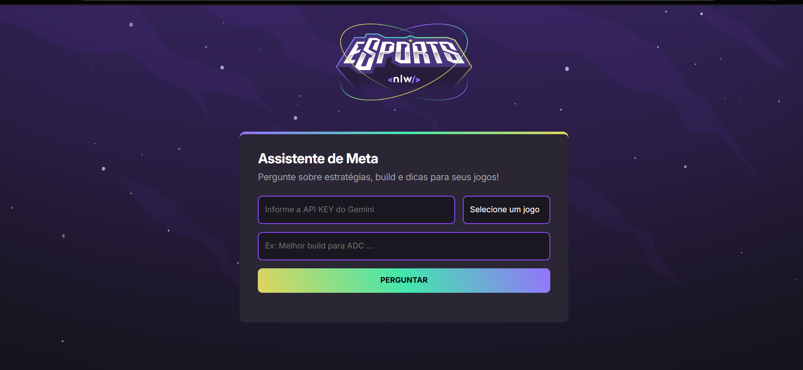

# 🎮 Assistente de Meta - NextLevel

 
 

O **Assistente de Meta** é uma aplicação web interativa desenvolvida para auxiliar jogadores de *Valorant*, *League of Legends* e *Call of Duty Mobile* com estratégias, builds e dicas otimizadas com base no meta atual dos jogos. Utilizando a API do Gemini da Google, o assistente fornece respostas precisas e atualizadas com base em dados reais e patch notes recentes.

---

## ✨ Funcionalidades

- 📌 Escolha entre os jogos suportados: **Valorant**, **LoL** e **CoD Mobile**  
- 🤖 Receba sugestões e dicas de gameplay baseadas no **meta atual**  
- 🔐 Integração segura com a **API Key** da Google Gemini  
- 🧠 Respostas inteligentes com base em *machine learning* e *pesquisa assistida*  
- 🎨 Interface moderna, responsiva e animada para uma ótima experiência do usuário

---

## 🚀 Como Funciona

1. O usuário informa sua **API Key Gemini**.
2. Escolhe o jogo de interesse.
3. Faz uma pergunta sobre estratégia, build ou dica.
4. O assistente envia a consulta para o Gemini, que retorna uma resposta formatada e direta ao ponto.

---

## 🛠️ Tecnologias Utilizadas

- **HTML5** e **CSS3** com responsividade e animações
- **JavaScript (Vanilla)** para lógica e integração com API
- **Showdown.js** para conversão de Markdown para HTML
- **Google Gemini API** com suporte a ferramentas de pesquisa

---

## 📁 Estrutura do Projeto

- `index.html` → Estrutura da interface  
- `style.css` → Estilo e layout da aplicação  
- `script.js` → Lógica, comunicação com Gemini e interações do usuário

---

## ⚠️ Observações Importantes

- É necessário possuir uma **API Key válida** da **Google Gemini** para utilizar o assistente.
- As respostas são limitadas a até **500 caracteres** para manter clareza e objetividade.
- A aplicação utiliza diretrizes rigorosas para não inventar informações e sempre prioriza dados confiáveis.

---

## 📷 Prévia

*Adicione uma imagem ou GIF acima para demonstrar a aplicação em funcionamento.*

---